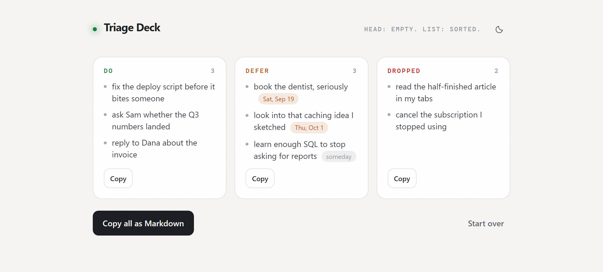

# Triage Deck

A single-file tool for emptying your head onto a list, then deciding one thing at a time.

**[Try it here](https://mcciii1203.github.io/triage-deck/)** - nothing to install, and
nothing you type leaves your browser.

Or clone it and open `index.html` directly: no build, no server, no network.


## How it works

1. **Dump** - paste or type one thought per line. Don't organise, don't judge.
   Leading bullets (`-`, `*`, `1.`, `[ ]`) are stripped automatically.
2. **Deal** - thoughts come back as a card stack, one at a time.
3. **Decide** - for each card:

   | Key | Action | Means |
   |-----|--------|-------|
   | `Left arrow`  | Drop  | let it go |
   | `Down arrow`  | Defer | pick a date (see below) |
   | `Right arrow` | Do    | it's on the list |
   | `E` | Edit | reword the card in place |
   | `Z` / `Backspace` | Undo | take the last one back |

   You can also drag a card and fling it in the same direction, or click the buttons.

4. **Copy out** - three clean buckets, copyable individually or all at once as Markdown.



## Fixing a badly worded card

Press `E` (or double-click the card) to edit the top card where it sits. `Enter`
saves, `Esc` reverts, and clicking away keeps what you typed. Emptying a card
reverts it rather than leaving a blank item, and runs of whitespace are collapsed.

Edits update the item itself, so they flow through to the defer sheet, the buckets
and the Markdown export. While a card is being edited the deck shortcuts stand down,
so an arrow key types a character instead of triaging half-written text.

## Deferring to a date

Defer asks *when*, so the defer pile stays a real queue instead of a second inbox.
The sheet is keyboard-first, so a defer is two keystrokes:

- `1` / `2` / `3` / `4` - Tomorrow, This weekend, Next week, Next month
- `0` - Someday (no date)
- the date field - any specific day
- `Esc` - cancel, the card stays on the deck

Presets that land on the same day are collapsed, so near the weekend you'll see
three options rather than a duplicate. Deferred items are listed and exported in
date order, with undated "someday" items last:

```markdown
## Defer
- fix the deploy script before it bites someone - 2026-09-19
- look into that caching idea I sketched - 2026-10-01
- reply to Dana about the invoice
```

Dates are stored as plain local `YYYY-MM-DD` strings - no timezone surprises, and
easy to paste into whatever actually runs your week.

## Dark and light

The app follows your system theme on first visit. The sun/moon button in the header
switches it, and that choice is remembered and then wins over the system setting -
until you clear it, the app stops following the OS. The theme is resolved in a small
inline script before the body parses, so the page never flashes the wrong colours.

## Notes

- Progress is saved to `localStorage` after every card, so closing the tab mid-deck
  offers a **Resume last session** button next time. Storage failures are non-fatal
  (private windows, blocked site data) - the app just runs without persistence.
- Do and Drop entries are stored as plain strings; Defer entries are
  `{ text, when }`. The accessors tolerate both, so sessions saved before dates
  existed still resume cleanly.
- Nothing is sent anywhere. The whole app is one HTML file.
